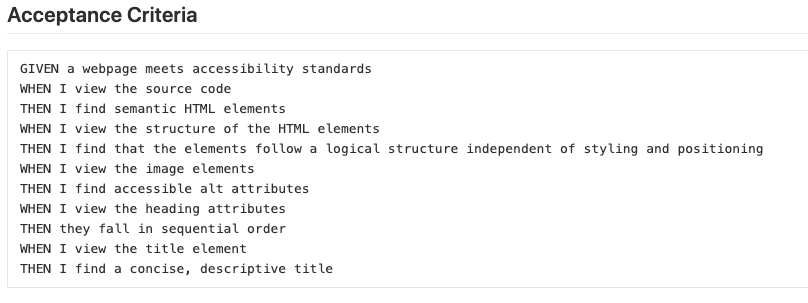

# hw1-code-refactor

## Installation/Deployment

Open the html file in the browser. Another option is to go to this link: <https://github.com/skimmers/hw1-code-refactor> and examine the html and css files.

Please check to see if the assignment goals are met.

## Goal

The goal is to refactor the code that the marketing company sent. I tried to make the code cleaner, concise, and accessible.

These are the requirements I had to meet: 
 

The front-end development must stay the same as:

## Purpose

I believe the purpose of this assignment was to imitate a real world situation if I were to be a professional web developer. 

I learned how to consolidate repetitve code into classes and combinators, when to use ids, and how to add alt text to images.

I learned to google questions I didn't learn how to answer and keep trying my best to make my code better. 